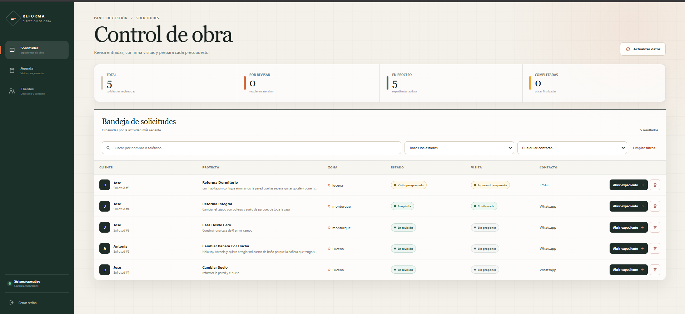
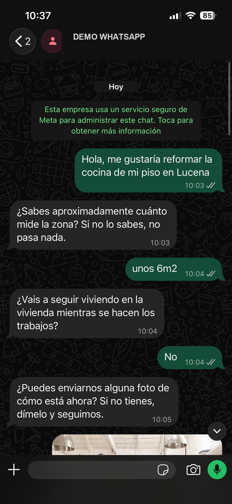
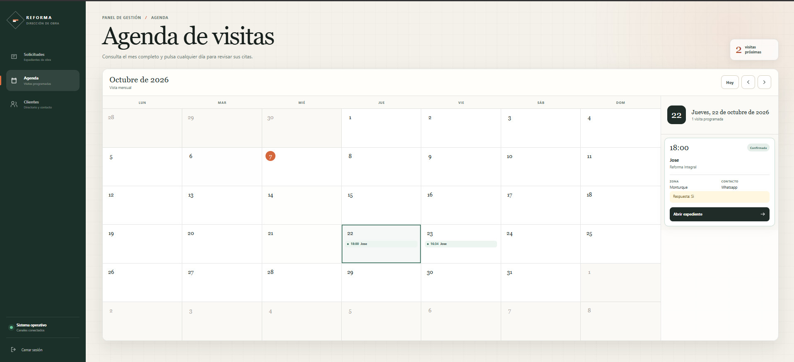
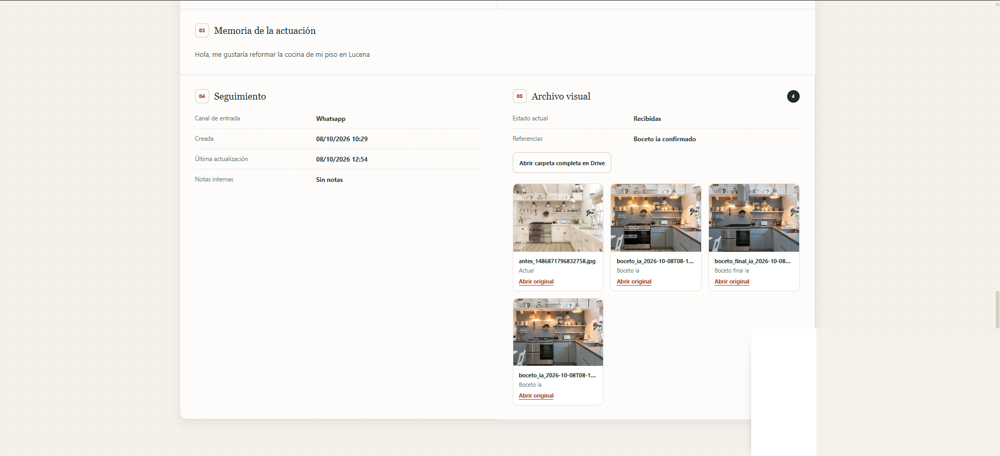
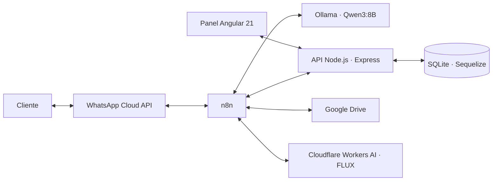

# Asistente IA para empresas de reformas


Plataforma que convierte conversaciones de WhatsApp en solicitudes de reforma organizadas y accionables. El asistente recopila la información del cliente, interpreta mensajes escritos de forma natural, ordena fotografías y deja cada expediente preparado para que la empresa pueda revisarlo, concertar una visita, enviar un presupuesto y seguir la obra desde un panel privado.

> **Estado del proyecto:** versión alpha funcional desarrollada como proyecto personal. Está abierta a pruebas, sugerencias y mejoras; todavía no es un producto preparado para producción.



## El problema

En muchas empresas de reformas, las nuevas peticiones llegan mezcladas entre llamadas, correos y mensajes de WhatsApp. El responsable termina revisando conversaciones a todas horas —incluso fuera de la jornada o durante las vacaciones— para averiguar qué quiere cada cliente, dónde se realizará el trabajo, cuándo podría comenzar y qué fotografías ha enviado.

Este proyecto automatiza esa primera recogida de información. No sustituye la valoración profesional ni toma decisiones por la empresa: reduce el trabajo repetitivo y presenta cada solicitud de forma estructurada para que el equipo conserve el control.

## Cómo funciona

1. **El cliente escribe por WhatsApp** como lo haría normalmente, sin formularios rígidos.
2. **Ollama y Qwen3:8B interpretan el mensaje en local** y extraen los datos relevantes de la reforma.
3. **n8n coordina la conversación**, recuerda qué información falta, aplica validaciones y conecta los servicios.
4. **Las fotografías se organizan en Google Drive** dentro del expediente correspondiente.
5. Si el cliente lo desea, **FLUX genera un boceto orientativo** que puede modificarse mediante nuevas indicaciones.
6. Tras la confirmación, **Node.js registra la solicitud en SQLite** y el panel Angular la muestra al equipo.
7. Desde el panel se puede **revisar la petición, proponer una visita, preparar el mensaje, registrar el presupuesto y marcar la obra como completada**.

La interpretación combina IA con reglas deterministas. Esto permite comprender respuestas como `wasa`, `wasap`, `WhatsApp`, `correo` o `gmail`, y evita depender únicamente de una salida generada por el modelo.

<table>
  <tr>
    <td width="38%"></td>
    <td width="62%"></td>
  </tr>
  <tr>
    <td align="center"><strong>Conversación flexible</strong></td>
    <td align="center"><strong>Seguimiento desde el panel</strong></td>
  </tr>
</table>

## Funcionalidades actuales

### Atención al cliente

- Recogida guiada de nombre, zona, tipo de trabajo, estancia, medidas y fecha orientativa.
- Detección de si la vivienda permanecerá habitada durante los trabajos.
- Elección del canal de contacto: WhatsApp o correo electrónico.
- Comprensión de expresiones coloquiales, errores ortográficos y respuestas breves según el contexto.
- Corrección de datos antes de confirmar la solicitud.
- Varias solicitudes asociadas al mismo cliente sin mezclar los expedientes.

### Fotografías y diseño

- Recepción de fotografías del estado actual y de referencias visuales.
- Organización automática por cliente y solicitud en Google Drive.
- Generación de bocetos orientativos con FLUX mediante Cloudflare Workers AI.
- Iteraciones sobre el último boceto: el cliente puede pedir cambios concretos y confirmar el resultado final.
- Galería integrada en el expediente administrativo.



### Gestión de la empresa

- Inicio de sesión para el equipo administrativo.
- Bandeja de solicitudes con búsqueda y filtros por estado y canal de contacto.
- Expediente completo con datos del cliente, memoria, seguimiento y archivo visual.
- Propuesta de visitas y registro de la respuesta del cliente.
- Agenda mensual de visitas confirmadas o pendientes.
- Aceptación de solicitudes y registro del presupuesto.
- Preparación de mensajes para WhatsApp o correo; el envío permanece bajo control humano.
- Estados de seguimiento desde la entrada de la solicitud hasta la obra completada.
- Directorio de clientes y acceso a su historial de solicitudes.

## Arquitectura



La parte conversacional se ejecuta en un entorno local con Ollama. Meta gestiona el canal de WhatsApp, Google Drive almacena las imágenes y Cloudflare genera los bocetos, por lo que esos servicios externos siguen interviniendo en el flujo completo.

## Tecnologías

| Área | Tecnologías |
| --- | --- |
| Frontend | Angular 21, TypeScript, SCSS, RxJS |
| Backend | Node.js, Express 5 |
| Persistencia | Sequelize, SQLite |
| Automatización | n8n, Docker Desktop |
| IA conversacional local | Ollama, Qwen3:8B |
| Mensajería | WhatsApp Cloud API de Meta |
| Generación visual | FLUX (`flux-2-klein-4b`) mediante Cloudflare Workers AI |
| Archivos | Google Drive |
| Autenticación | JWT, bcryptjs, cookies `HttpOnly` |
| Desarrollo e integración | ngrok |

## Estructura del repositorio

```text
back_reformas/
  config/          Configuración de autenticación
  controllers/     Lógica de los endpoints
  database/        Conexión con SQLite
  middleware/      Protección de rutas administrativas
  models/          Modelos y relaciones de Sequelize
  routes/          Rutas de la API REST
  index.js         Inicio del servidor

front_reformas/
  src/app/
    components/    Login, solicitudes, detalle, agenda y clientes
    guards/        Protección de navegación
    interfaces/    Tipos de datos
    services/      Comunicación con la API

docs/
  index.html       Política de privacidad
  readme/          Capturas de demostración
```

### Alcance del código publicado

El repositorio contiene el backend, el frontend y la página de privacidad. El workflow completo de n8n y las credenciales de Meta, Google Drive y Cloudflare no están incluidos. Clonar este código permite ejecutar el panel y la API, pero no configura automáticamente el asistente de WhatsApp.

## Puesta en marcha local

### Requisitos

- Node.js y npm compatibles con Angular 21.
- Para el flujo conversacional completo: Docker, n8n, Ollama y las integraciones externas configuradas.

### 1. Clonar el repositorio

```bash
git clone https://github.com/JoseBurguillos/Asistente-empresa-de-reformas.git
cd Asistente-empresa-de-reformas
```

### 2. Iniciar el backend

```bash
cd back_reformas
npm install
```

Crear `back_reformas/.env`:

```dotenv
PORT=3001
JWT_SECRET=utiliza_un_secreto_aleatorio_largo
```

Después:

```bash
npm run dev
```

También puede iniciarse sin recarga automática con `npm start`. La API utiliza por defecto `http://localhost:3001` y `GET /health` devuelve `{ "ok": true }` cuando el servidor está disponible.

SQLite se almacena en `back_reformas/data/reformas.db`. El arranque sincroniza los modelos y aplica los ajustes de esquema incluidos en el código.

> El prototipo crea una cuenta administrativa inicial si todavía no existe. Antes de exponer el servicio, cambia esa configuración en `crearAdminInicial()` y no reutilices credenciales de demostración.

### 3. Iniciar el frontend

En otra terminal:

```bash
cd front_reformas
npm install
npm start
```

Abrir `http://localhost:4200`. Para crear una compilación de producción:

```bash
npm run build
```

Los servicios del frontend apuntan al backend local en el puerto `3001` y envían las cookies de sesión. Si se cambia el host o el puerto, hay que actualizar las URL de los servicios y los orígenes CORS del backend.

### 4. Conectar la automatización

El flujo de n8n se configura por separado. Debe recibir los eventos de WhatsApp, recuperar el estado de la conversación, consultar Ollama, validar la respuesta, registrar la solicitud y coordinar Google Drive y Cloudflare.

Durante el desarrollo puede utilizarse ngrok para exponer el webhook local. Este repositorio no incluye un despliegue automatizado ni un workflow importable listo para producción.

## Seguridad y privacidad

- No publiques archivos `.env`, tokens, credenciales ni bases de datos con información real.
- Utiliza únicamente datos ficticios o anonimizados en demostraciones y capturas.
- Protege las rutas empleadas por las integraciones y limita su acceso en producción.
- Configura HTTPS, copias de seguridad y rotación de secretos antes de desplegar.
- Las sesiones administrativas duran ocho horas; la cookie utiliza `HttpOnly`, `SameSite=Lax` y activa `Secure` con `NODE_ENV=production`.

Los bocetos generados son únicamente orientativos. No sustituyen un proyecto técnico, una medición ni una valoración profesional.

## Estado y próximos pasos

Actualmente el proyecto funciona como una demostración local e híbrida. Antes de considerarlo apto para producción quedan, entre otras tareas:

- reforzar la autenticación de las rutas de integración;
- mover toda la configuración de hosts y credenciales a variables de entorno;
- añadir pruebas automatizadas y validaciones de extremo a extremo;
- preparar un despliegue permanente con dominio y HTTPS;
- definir copias de seguridad, registro de errores y monitorización;
- continuar mejorando la experiencia móvil y la accesibilidad.

Las propuestas, pruebas y recomendaciones son bienvenidas. Puedes abrir una *issue* explicando el caso de uso o la mejora que te gustaría ver.

## Autor

**José Burguillos** · [GitHub](https://github.com/JoseBurguillos) · [Portfolio](https://joseburguillos.vercel.app)
