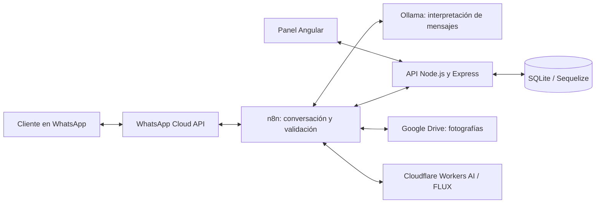

# Asistente inteligente para empresas de reformas

Plataforma que automatiza la recepción y el seguimiento de solicitudes de reformas por WhatsApp. Combina **n8n, inteligencia artificial, Node.js y Angular** para transformar una conversación en una solicitud organizada, con fotografías, preferencias y un panel privado de gestión.

El cliente describe su reforma desde WhatsApp y el equipo consulta la información, programa visitas y registra presupuestos desde el panel administrativo.

## Funcionalidades

- **Atención conversacional:** recopilación guiada de datos del cliente, ubicación, tipo de reforma, medidas y fecha orientativa, con una pregunta cada vez.
- **Contexto por conversación:** seguimiento de la información pendiente, correcciones y nuevas solicitudes del mismo cliente.
- **Automatización con n8n:** workflow de más de 50 nodos que conecta mensajería, interpretación con IA, validación de datos y persistencia.
- **Fotografías organizadas:** almacenamiento en Google Drive de imágenes del estado actual, referencias y bocetos asociados a cada solicitud.
- **Bocetos con IA:** generación y modificación iterativa de imágenes mediante FLUX en Cloudflare Workers AI, con confirmación por WhatsApp.
- **Panel administrativo:** búsqueda y filtrado de solicitudes, consulta del detalle, fotografías, estados, visitas y presupuestos.
- **Ejemplos confirmados:** recuperación de interpretaciones anteriores como contexto para la IA, sin entrenar un modelo desde cero.
- **Autenticación:** acceso administrativo con JWT en una cookie `HttpOnly` y contraseñas almacenadas como hashes con bcryptjs.

Los bocetos son orientativos: ayudan a visualizar una reforma y no sustituyen un proyecto técnico ni una valoración profesional.

## Arquitectura



La IA interpreta los mensajes y extrae información. Después, reglas deterministas validan los datos antes de guardarlos, con el objetivo de reducir errores y confirmaciones prematuras. La conversación conserva su estado mediante el teléfono del cliente; una nueva reforma tiene su propia solicitud y sus propias fotografías.

## Tecnologías

| Área | Tecnologías |
| --- | --- |
| Frontend | Angular 21, TypeScript, SCSS |
| Backend | Node.js, Express 5 |
| Persistencia | Sequelize, SQLite |
| Automatización | n8n, Docker Desktop |
| Mensajería | WhatsApp Cloud API de Meta |
| Interpretación de mensajes | Ollama |
| Generación de imágenes | FLUX mediante Cloudflare Workers AI |
| Archivos | Google Drive |
| Autenticación | JWT, bcryptjs, cookies `HttpOnly` |
| Conexión durante el desarrollo | ngrok |

## Contenido del repositorio

```text
back_reformas/
  config/          Configuración de autenticación
  controllers/     Lógica de los endpoints
  database/        Conexión con SQLite
  middleware/      Comprobación de acceso administrativo
  models/          Modelos y relaciones de Sequelize
  routes/          Rutas de la API
  index.js         Inicio del servidor
front_reformas/
  src/app/
    components/    Login, listado y detalle de solicitudes
    guards/        Protección de navegación
    interfaces/    Tipos de datos
    services/      Comunicación con la API
docs/
  index.html       Política de privacidad
```

**Alcance:** este repositorio contiene el backend, el frontend y la página de privacidad. El workflow exportado de n8n y las credenciales de los servicios externos no están incluidos. La descripción de la automatización corresponde al sistema completo; clonar este repositorio por sí solo no configura el asistente de WhatsApp.

## Puesta en marcha local

### Requisitos

- Node.js y npm compatibles con las dependencias de Angular 21 y del backend.
- Para la conversación completa: n8n, Ollama y las integraciones configuradas con Meta, Google Drive y Cloudflare.

### 1. Clonar el repositorio

```bash
git clone https://github.com/JoseBurguillos/Asistente-empresa-de-reformas.git
cd Asistente-empresa-de-reformas
```

### 2. Iniciar el backend

```bash
cd back_reformas
npm install
```

Crear `back_reformas/.env` con la configuración local:

```dotenv
PORT=3001
JWT_SECRET=reemplazar_por_un_secreto_aleatorio_largo
```

No publicar el archivo `.env`. Después, desde `back_reformas`:

```bash
npm run dev
```

También se puede iniciar sin recarga automática con `npm start`. La API utiliza por defecto `http://localhost:3001`; `GET /health` devuelve `{ "ok": true }` cuando el servidor está disponible. SQLite se almacena en `back_reformas/data/reformas.db` y el arranque sincroniza los modelos y aplica los ajustes de esquema definidos en el código.

El código crea una cuenta administrativa inicial con valores predeterminados si no existe. Revisar `crearAdminInicial()` en `back_reformas/index.js` y sustituir esa configuración antes de exponer el servicio; cambiar el código de inicialización no actualiza una cuenta que ya existe.

### 3. Iniciar el frontend

En otra terminal, desde la raíz del repositorio:

```bash
cd front_reformas
npm install
npm start
```

Abrir `http://localhost:4200`. Los servicios del frontend apuntan al backend local en el puerto 3001 y envían las cookies de sesión. Si se cambia el host o el puerto, hay que actualizar las URL de los servicios y los orígenes CORS del backend.

Para compilar el frontend:

```bash
npm run build
```

### 4. Conectar la automatización

El flujo de n8n se configura por separado para recibir los mensajes de WhatsApp, consultar el contexto en la API, interpretar respuestas con Ollama, validar información y registrar solicitudes. También necesita acceso a Google Drive y Cloudflare para gestionar fotografías y bocetos.

En el entorno descrito se usa ngrok para hacer accesible el webhook durante el desarrollo. No hay un archivo de workflow importable en este repositorio ni un despliegue completo automatizado.

## Sesiones y acceso

Las sesiones administrativas duran ocho horas. Las cookies usan `HttpOnly` y `SameSite=Lax`, y activan `Secure` cuando `NODE_ENV=production`. Si no se define `JWT_SECRET`, el backend genera un secreto temporal y las sesiones dejan de ser válidas al reiniciarlo.

Las operaciones administrativas protegidas requieren el rol de administrador. Algunas rutas de integración, como la creación de solicitudes utilizada por n8n, no emplean ese mismo middleware: antes de publicar la API deben contar con autenticación apropiada para la integración o restricciones de red.

## Estado de ejecución y despliegue

El sistema descrito funciona en un entorno local e híbrido: frontend, backend, Ollama y n8n se ejecutan localmente; WhatsApp, Drive y Cloudflare aportan los servicios externos.

Para un despliegue permanente quedan por configurar el alojamiento del backend y n8n, dominio y HTTPS, credenciales definitivas, protección de las rutas de integración y copias de seguridad. Utilizar datos de prueba al preparar una demostración y revisar la base de datos antes de compartirla.

## Autor

**José Burguillos** · [GitHub](https://github.com/JoseBurguillos) · [Portfolio](https://joseburguillos.vercel.app)
